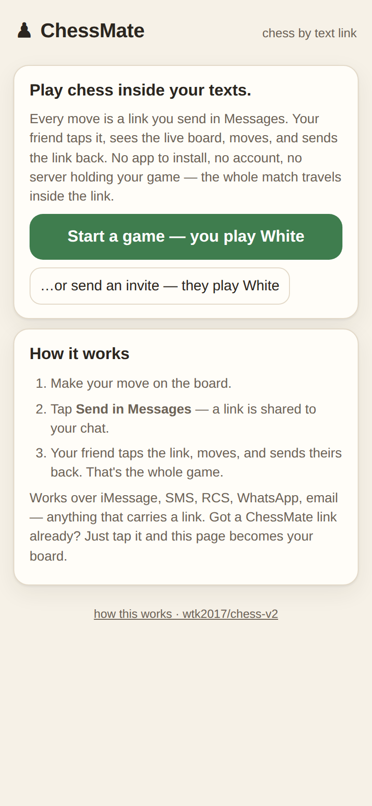
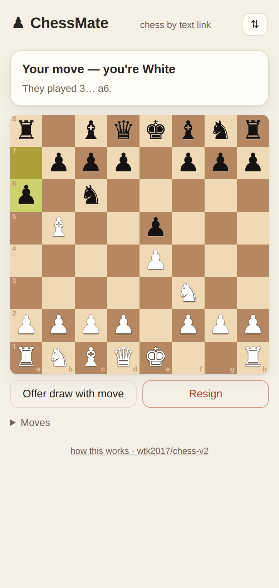
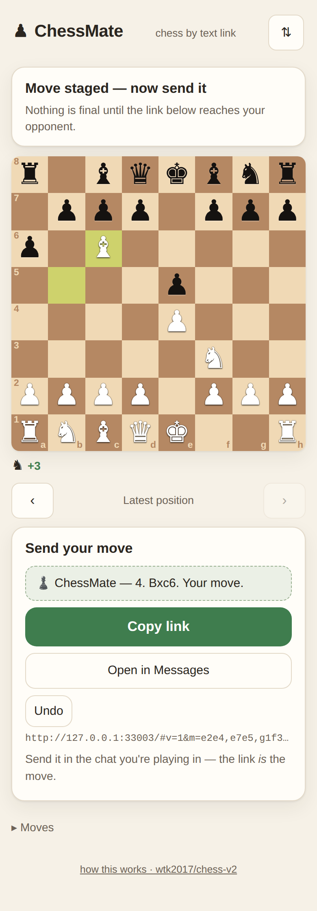
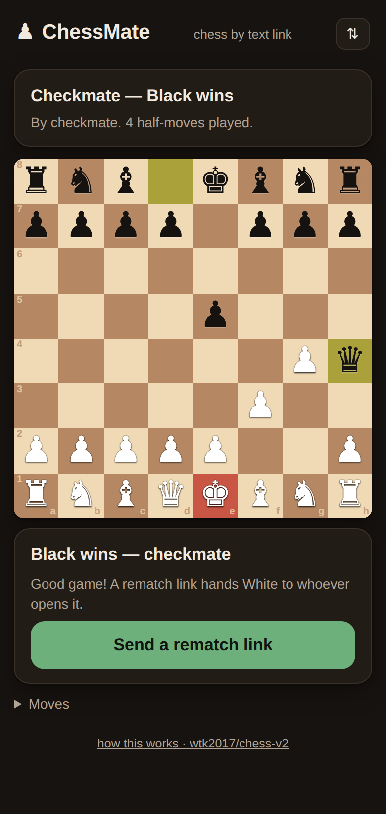

# ChessMate v2 ♟ — chess over iMessage links

**Correspondence chess that travels inside your texts. Playable between two
iPhones right now — no App Store, no TestFlight, no $99 Apple Developer fee,
nothing to install.**

[v1](https://github.com/wtk2017/chess) built this as a native iMessage app
extension and hit the one wall Apple never opens for free: putting an
extension on your *friend's* phone costs $99/year. v2 keeps v1's design —
the whole match encoded into a URL, no server, no accounts, no clock — and
swaps the renderer from a Messages extension to a web page. **Every move is a
link you send in Messages; the link *is* the move.** The full study and design
are in [DESIGN.md](DESIGN.md).

## What it looks like

| Start a game | A link arrives — your move | Send it like a text | Checkmate |
| --- | --- | --- | --- |
|  |  |  |  |

*Real captures from `index.html` (light and dark mode) at iPhone size.*

## Play right now

**One 30-second prerequisite:** this repo is currently **private**, and the
free hosting paths below serve public repos only (GitHub Pages on the free
plan, and the githack raw mirror). A chess board holds no secrets — flip the
repo public: **Settings → General → Danger Zone → Change visibility**.
*(Want the repo private anyway? Either GitHub Pro unlocks Pages for private
repos, or point Cloudflare Pages / Netlify — both free — at it; the site is
just static files at the repo root.)*

Once public, two ways to a URL:

**The real home (one click):** run the **deploy-pages** workflow from the
Actions tab (it has a manual "Run workflow" button and can deploy any branch —
including this one, before merging; it also runs automatically on every push
to `main`, and enables Pages by itself). The game lands at:

```
https://wtk2017.github.io/chess-v2/
```

**Zero-enable dev preview:** this branch served raw through githack, live the
moment the repo is public, nothing to configure:

```
https://raw.githack.com/wtk2017/chess-v2/claude/chess-v2-imessage-design-f3kqjf/index.html
```

Then:

1. Open the page → **Start a game** → make White's first move.
2. Tap **Send in Messages** → pick your friend → send. The message reads
   *"♟️ ChessMate — new game! I opened 1. e4. You're Black — your move."*
3. They tap the link. Safari opens on the live board, oriented their way.
   They move, tap **Send in Messages**, and reply into the same thread.
4. Repeat until the engine declares a result. The iMessage thread is the
   game record; nothing exists anywhere else.

Draw offers ride along with a move ("Offer draw with move"), resignations and
rematches are one tap, and finished games declare themselves: checkmate,
stalemate, fifty-move rule, threefold repetition, dead position — the same
automatic arbitration as v1.

**Bonus v1 never had:** the link works for *green bubbles* too — Android,
SMS/RCS, WhatsApp, email, anything that can carry a URL.

## What's in this repo

| Path | What it is |
| --- | --- |
| `index.html` + `app.js` | The whole app: tap-to-move board with legal-move dots, promotion picker, draw/resign/rematch etiquette, share-sheet send panel. Static files, no build step, no dependencies. |
| `engine.js` | The full rules engine, ported from v1's Swift: legality (castling, en passant, promotion), check/checkmate/stalemate, fifty-move rule, threefold repetition, insufficient material, SAN, FEN, and the `MatchState` link codec (v1's wire format, minus device seats). Runs in the browser and in Node. |
| `test/run-tests.js` | Engine suite: perft against the six standard reference positions (v1's exact table; `PERFT_DEEP=1` adds depth-5/4, ~9M nodes) plus rules, SAN, and codec checks. `node test/run-tests.js` |
| `test/smoke.js` | Headless-Chromium test of the real two-phone loop: taps out games, harvests each staged link, reopens it as the opponent — through mate, promotion, draws, resignation, and corrupt-link rejection. |
| `tools/imessage-referee.py` | Optional extra: a Mac in a group chat as third-party referee — validates texted moves ("e4"), replies with SAN + a Unicode board + the tap-to-view link. Experimental, macOS only. See [DESIGN.md §5](DESIGN.md). |
| `DESIGN.md` | The study of v1, the options considered, the wire protocol, and the trade-offs. |
| `.github/workflows/` | `ci.yml` (engine + browser tests on every push) and `pages.yml` (deploy to GitHub Pages). |

## The wire format

The URL fragment carries v1's `MSMessage` payload, unchanged where it can be:

```
https://…/#v=1&m=e2e4,e7e5,g1f3&do=w
            │  │                └─ White offers a draw with this move
            │  └─ the full UCI move list — the game itself
            └─ format version
```

`rb=` marks a resignation, `da=1` an agreed draw. The full move list (not a
snapshot) is what makes every link self-verifying: the app replays it through
the rules engine and refuses illegal or tampered histories. State lives in the
`#fragment`, which browsers never send to any server — the static host sees
no game data at all. A 100-move game is still under 1 KB.

## Tests

```sh
node test/run-tests.js              # engine: perft + rules + codec  (~1s)
PERFT_DEEP=1 node test/run-tests.js # adds the 9M-node deep perft    (~30s)

npm i playwright && npx playwright install chromium
node test/smoke.js                  # real browser, real links, 12 scenarios
```

CI runs all of it on every push.

## Honest limitations

- **Honor system.** Opening a live link seats you as the side to move; between
  friends that's exactly postcard chess. Tampering is *detectable* (every link
  re-validates; the thread keeps every prior link) but not *prevented*.
  Same trust model as v1's device UUIDs, fewer moving parts.
- **One link per move** instead of v1's single self-updating bubble — plain
  links can't reuse an `MSSession`. The thread becomes a scrollable game log.
- The link preview card is generic ("♟️ ChessMate — your move"), not a board
  image; per-position previews need a tiny edge worker (free, but a server —
  see DESIGN.md §6).

## The road back to native

Nothing here replaces v1 — it *unblocks* it. The wire formats are compatible,
so if the $99 is ever paid, the extension and the web page ship as one
product: the native board where it's installed, the link everywhere else.
